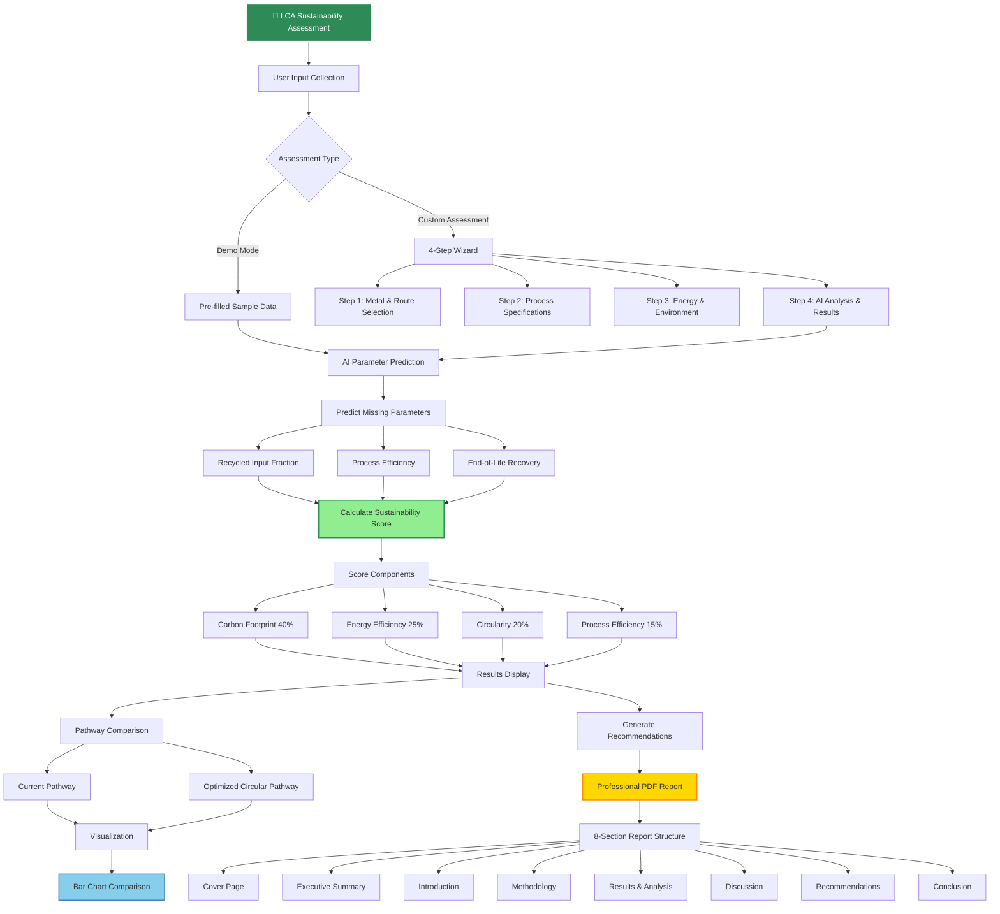
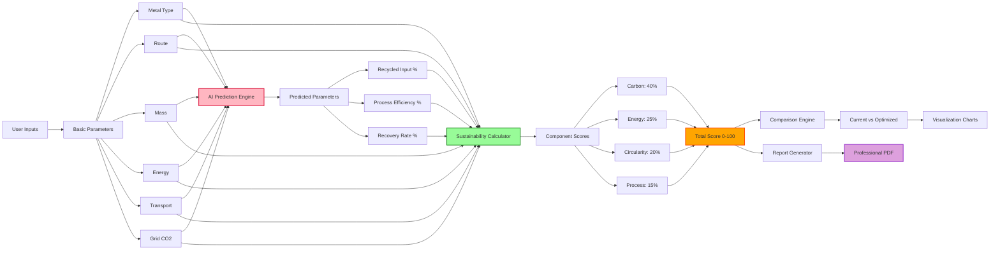
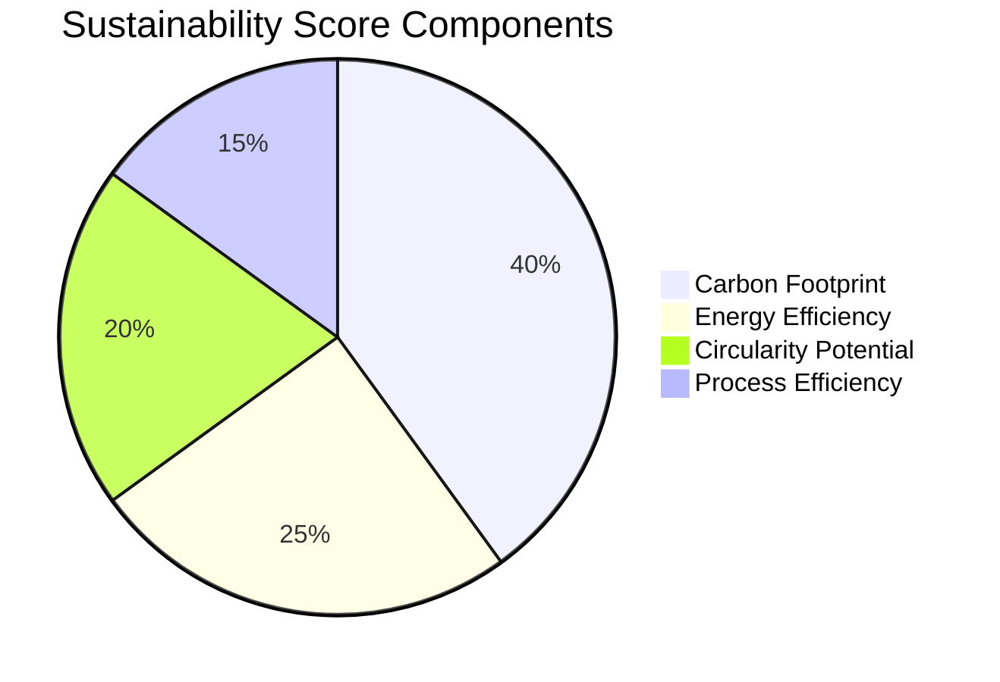
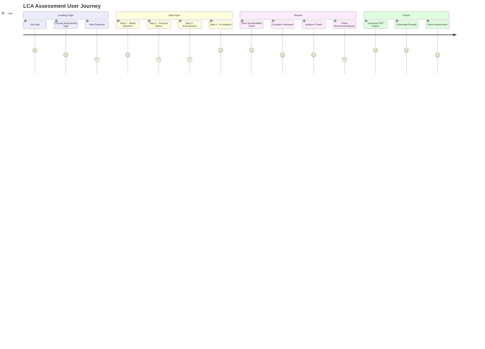

# LCA Sustainability Assessment Workflow - Mermaid Diagram

## Main Workflow Diagram

```mermaid
flowchart TD
    A[🌱 LCA Sustainability Assessment] --> B[User Input Collection]
    B --> C{Assessment Type}
    C -->|Demo Mode| D[Pre-filled Sample Data]
    C -->|Custom Assessment| E[4-Step Wizard]
    
    E --> E1[Step 1: Metal & Route Selection]
    E --> E2[Step 2: Process Specifications]
    E --> E3[Step 3: Energy & Environment]
    E --> E4[Step 4: AI Analysis & Results]
    
    D --> F[AI Parameter Prediction]
    E4 --> F
    
    F --> G[Predict Missing Parameters]
    G --> G1[Recycled Input Fraction]
    G --> G2[Process Efficiency]
    G --> G3[End-of-Life Recovery]
    
    G1 --> H[Calculate Sustainability Score]
    G2 --> H
    G3 --> H
    
    H --> I[Score Components]
    I --> I1[Carbon Footprint 40%]
    I --> I2[Energy Efficiency 25%]
    I --> I3[Circularity 20%]
    I --> I4[Process Efficiency 15%]
    
    I1 --> J[Results Display]
    I2 --> J
    I3 --> J
    I4 --> J
    
    J --> K[Pathway Comparison]
    K --> K1[Current Pathway]
    K --> K2[Optimized Circular Pathway]
    
    K1 --> L[Visualization]
    K2 --> L
    L --> M[Bar Chart Comparison]
    
    J --> N[Generate Recommendations]
    N --> O[Professional PDF Report]
    
    O --> P[8-Section Report Structure]
    P --> P1[Cover Page]
    P --> P2[Executive Summary]
    P --> P3[Introduction]
    P --> P4[Methodology]
    P --> P5[Results & Analysis]
    P --> P6[Discussion]
    P --> P7[Recommendations]
    P --> P8[Conclusion]
    
    style A fill:#2E8B57,stroke:#fff,stroke-width:3px,color:#fff
    style H fill:#90EE90,stroke:#2E8B57,stroke-width:2px
    style O fill:#FFD700,stroke:#FF8C00,stroke-width:2px
    style M fill:#87CEEB,stroke:#4682B4,stroke-width:2px
```

## Data Flow Diagram

```mermaid
graph LR
    A[User Inputs] --> B[Basic Parameters]
    B --> B1[Metal Type]
    B --> B2[Route]
    B --> B3[Mass]
    B --> B4[Energy]
    B --> B5[Transport]
    B --> B6[Grid CO2]
    
    B1 --> C[AI Prediction Engine]
    B2 --> C
    B3 --> C
    B4 --> C
    B5 --> C
    B6 --> C
    
    C --> D[Predicted Parameters]
    D --> D1[Recycled Input %]
    D --> D2[Process Efficiency %]
    D --> D3[Recovery Rate %]
    
    B1 --> E[Sustainability Calculator]
    B2 --> E
    B3 --> E
    B4 --> E
    B5 --> E
    B6 --> E
    D1 --> E
    D2 --> E
    D3 --> E
    
    E --> F[Component Scores]
    F --> F1[Carbon: 40%]
    F --> F2[Energy: 25%]
    F --> F3[Circularity: 20%]
    F --> F4[Process: 15%]
    
    F1 --> G[Total Score 0-100]
    F2 --> G
    F3 --> G
    F4 --> G
    
    G --> H[Comparison Engine]
    H --> I[Current vs Optimized]
    I --> J[Visualization Charts]
    
    G --> K[Report Generator]
    K --> L[Professional PDF]
    
    style C fill:#FFB6C1,stroke:#DC143C,stroke-width:2px
    style E fill:#98FB98,stroke:#228B22,stroke-width:2px
    style G fill:#FFA500,stroke:#FF4500,stroke-width:2px
    style L fill:#DDA0DD,stroke:#9932CC,stroke-width:2px
```

## PDF Report Structure

```mermaid
flowchart TD
    A[📄 Professional PDF Report] --> B[Cover Page]
    B --> B1[Assessment Details Table]
    B --> B2[Sustainability Score Display]
    B --> B3[Performance Category]
    
    A --> C[Executive Summary]
    C --> C1[Key Findings Overview]
    C --> C2[Performance Highlights]
    
    A --> D[Introduction]
    D --> D1[LCA Methodology Explanation]
    D --> D2[Assessment Purpose]
    
    A --> E[Methodology]
    E --> E1[Assessment Stages]
    E --> E2[Scoring Components]
    E --> E3[Weight Distribution]
    
    A --> F[Results & Analysis]
    F --> F1[Overall Score Presentation]
    F --> F2[Component Breakdown Table]
    F --> F3[Route Analysis]
    
    A --> G[Discussion]
    G --> G1[Score Interpretation]
    G --> G2[Industry Context]
    G --> G3[Performance Drivers]
    
    A --> H[Recommendations]
    H --> H1[Process Improvements]
    H --> H2[Technology Upgrades]
    H --> H3[Certification Pathways]
    
    A --> I[Conclusion]
    I --> I1[Performance Summary]
    I --> I2[Strategic Implications]
    
    style A fill:#2E8B57,stroke:#fff,stroke-width:3px,color:#fff
    style F fill:#90EE90,stroke:#2E8B57,stroke-width:2px
    style H fill:#FFD700,stroke:#FF8C00,stroke-width:2px
```

## Component Scoring System

```mermaid
pie title Sustainability Score Components
    "Carbon Footprint" : 40
    "Energy Efficiency" : 25
    "Circularity Potential" : 20
    "Process Efficiency" : 15
```

## User Journey Map

```mermaid
journey
    title LCA Assessment User Journey
    section Landing Page
      Visit App: 5: User
      Choose Assessment Type: 4: User
      View Features: 3: User
    section Data Input
      Step 1 - Metal Selection: 4: User
      Step 2 - Process Specs: 3: User
      Step 3 - Environment: 3: User
      Step 4 - AI Analysis: 5: User
    section Results
      View Sustainability Score: 5: User
      Compare Pathways: 4: User
      Analyze Charts: 4: User
      Read Recommendations: 3: User
    section Export
      Generate PDF Report: 5: User
      Download Results: 5: User
      Save Assessment: 4: User
```